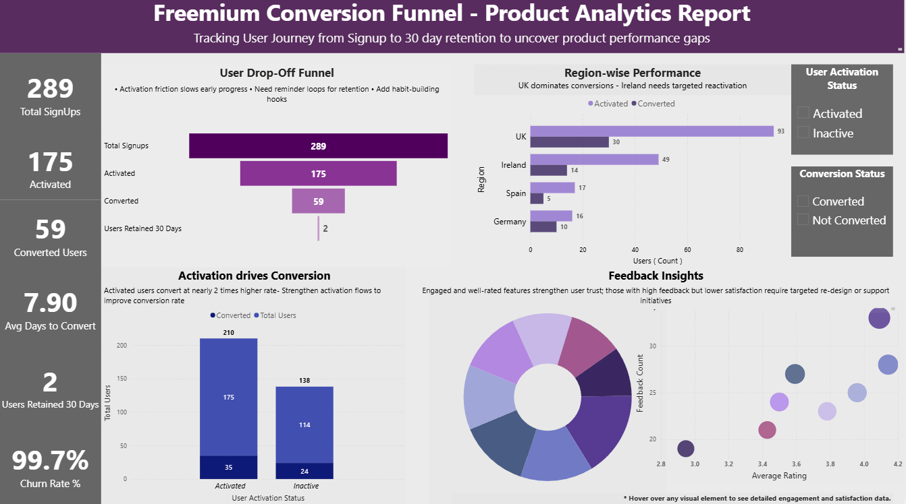

# 📊 Freemium Conversion Funnel – Power BI Dashboard
*Visual Analytics on User Activation, Retention, and Product Feedback*

## 🖼️ Dashboard Preview

Here’s the final **Power BI Dashboard** for the Freemium Conversion Funnel project:

  

### 🌟 Project Overview
Interactive dashboard to visualize how users move through the freemium funnel and what drives engagement and feedback.

👉 **Companion project:** [Freemium Conversion Funnel – SQL Analytics](https://github.com/SHREYA-TK/Freemium-Conversion-Funnel-SQL-Analytics)

### 🧠 Objectives
1. Visualize signup → activation → conversion.
2. Identify drop-off points and retention.
3. Measure satisfaction and feedback.
4. Help product teams act on insights.

### 🧩 Dataset & Model
- `conversion_funnel` and `feedback` tables.
- SQL: 20 rows | Power BI: 300 rows (for visualization).

### 🧹 Data Quality
11 blank users kept intentionally to reflect real drop-offs.

### 🧮 Key Measures (DAX)
- Activated Users
- Converted Users
- Retention 30D
- Churn Rate

### 🎨 Dashboard Design
| Section | Chart | Purpose |
|----------|--------|----------|
| User Funnel | Funnel | Signup → Activation → Conversion |
| Region-Wise | Bar | Performance by region |
| Activation vs Conversion | Column | Relationship between activation & conversion |
| Feedback | Scatter + Donut | Ratings & review volume |
| KPIs | Cards | Core metrics summary |

### 🎛️ Interactions
- **Slicers:** User Activation Status, Conversion Status.
- **Tooltips:** Hover to reveal insights (feature, ratings, feedback count).

### 🎨 Colors
| Element | Color | Purpose |
|----------|--------|----------|
| Primary | Purple/Lavender | Modern SaaS tone |
| Accent | Slate Gray / Blue | Balance contrast |
| KPI Cards | Neutral Gray | Focus on metrics |

### 🧩 Insights Summary
1. Activation drives conversion.
2. Regional conversion gaps.
3. High-rated features correlate with engagement.
4. Data quality note (11 blanks).

### 🧭 Recommendations
- Simplify onboarding.
- Analyze weak conversion regions.
- Focus on high-engagement features.

### 🧰 Tools
Power BI, DAX, SQL, Excel/CSV

###**Linked Project:** [SQL Analytics Project](https://github.com/SHREYA-TK/Freemium-Conversion-Funnel-SQL-Analytics)
